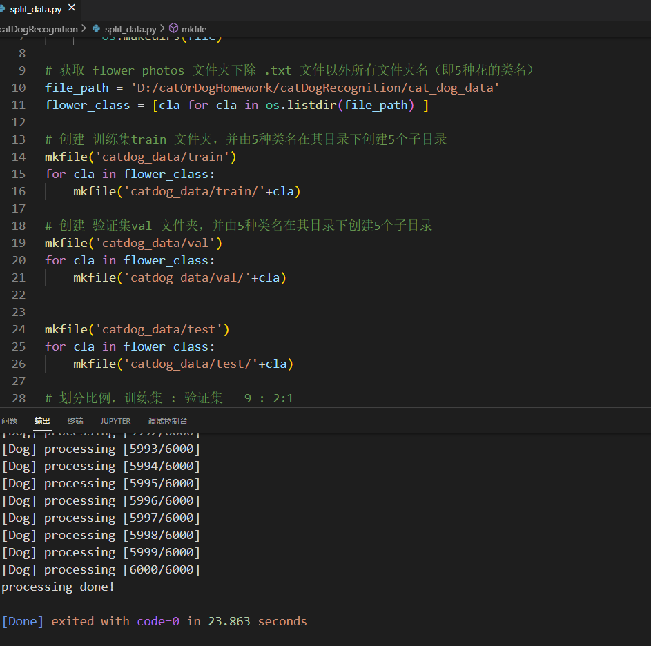
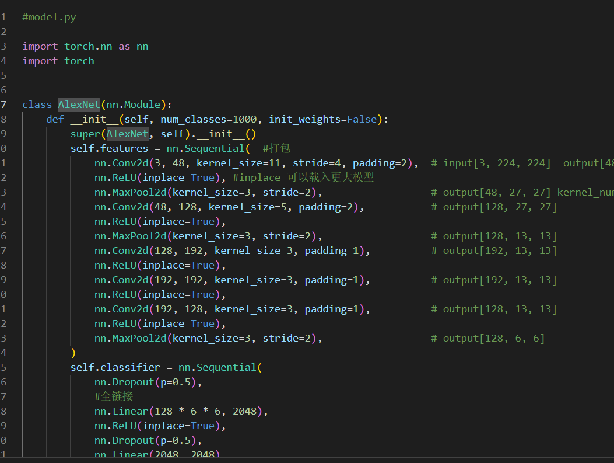
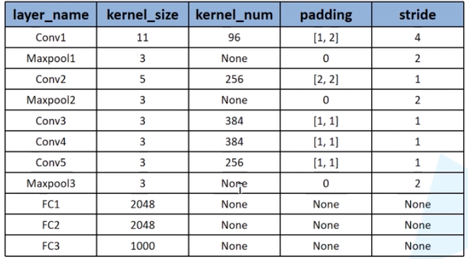
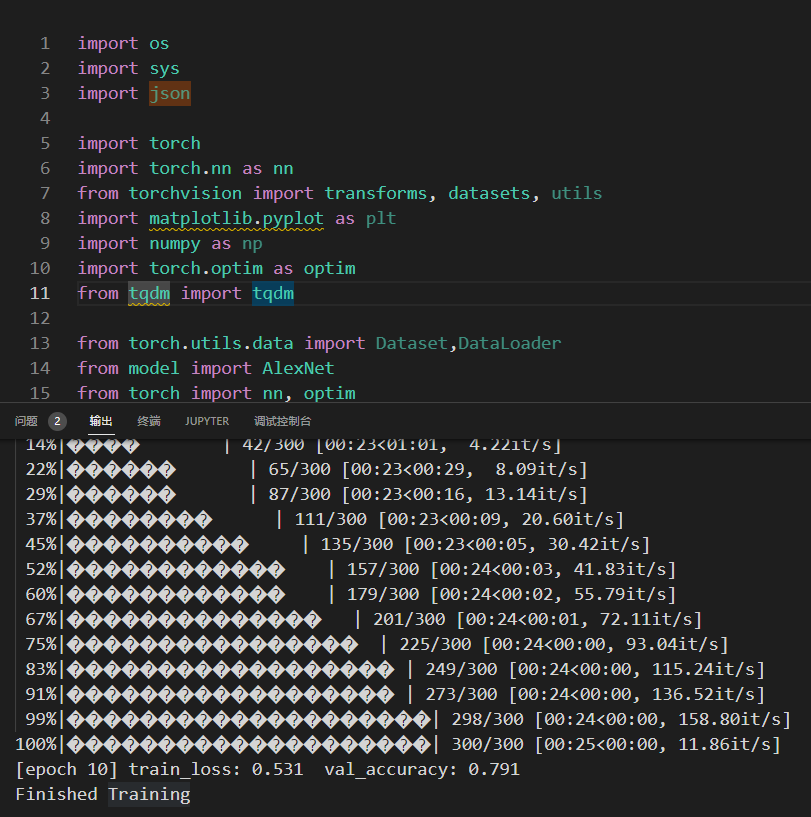
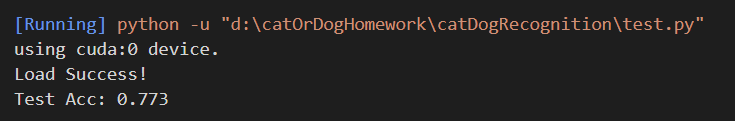

### （一）概述

1. 使用程序自动分开文件夹数据
2. 加验证集
3. 准确率超过70%
4. 使用卷积

### （二）模型建立

1. 模型名称：猫狗分类模型

2. 网络结构：经典 `AlexNet` 网络结构建立

3. 数据集：猫 6000 + 狗 6000

   ​				自动分类为训练集：测试集：验证集 == 7：2：1

4. 参考教程：https://www.bilibili.com/video/BV1p7411T7Pc（根据视频中的花分类模型复现并改写）

5. 完整的目录结构如下

   ```c++
   |-- catDogRecognition
   	|-- cat_dog
   		|-- cat
   		|-- dog
   	|-- catdog_data
   	    |-- test
               |-- cat
               |-- dog
           |-- train
               |-- cat
               |-- dog
           |-- val
               |-- cat
               |-- dog
   	|-- readme.assets
   	|-- AlexNet.pth
   	|-- model.py
   	|-- readme.md
   	|-- spile_data.py
   	|-- test.py
   	|-- train_val.py
   ```

#### spile_data.py

按 训练集：测试集：验证集 == 7：2：1 自动分类，运行截图如下：



#### model.py

详见论文：《ImageNet Classification with Deep Convolutional Neural Networks》





#### train_val.py

结果如下：



#### test.py

结果如下：



### （三）结果

epoch: 10

train_loss: 0.531 

val_accuracy: 0.791

Test Acc: 0.773
